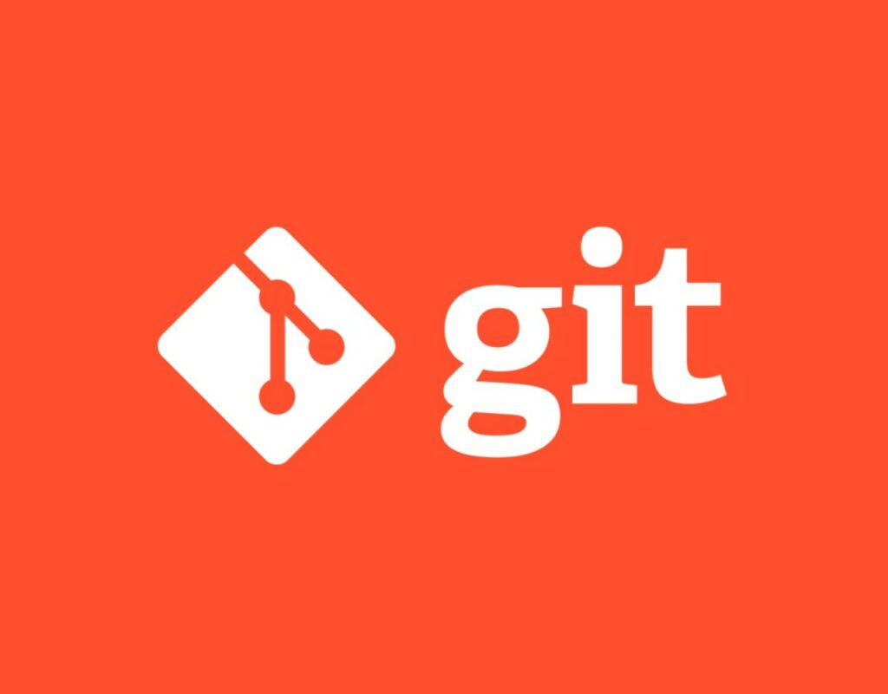

# Инструкция по консольным командам Git

 # Настройки

Перед началом работы нужно выполнить некоторые настройки:

git config --global user.name "Your Name" # указать имя, которым будут подписаны коммиты
git config --global user.email "e@w.com"  # указать электропочту, которая будет в описании коммитера

# Консольные команды 

## Создать новый репозиторий 

git init - создать новый проект в текущей директории

git init folder-name - создать новый проект в указанной директории

git status  - показать состояние репозитория (отслеживаемые, изменённые, новые файлы и пр.)

## Просмотр изменений ##
* git status - показать состояние репозитория (отслеживаемые, изменённые, новые файлы и пр.)
* git diff - сравнить рабочую директорию и индекс (неотслеживаемые файлы ИГНОРИРУЮТСЯ)

## Коммиты
git commit -m "Name of commit"  - зафиксировать в коммите проиндексированные изменения (закоммитить), добавить сообщение

## Цитаты ##

Для обозначения цитат в языке Markdown используется знак «больше» («>»). Его можно вставлять как перед каждой строкой цитаты, так и только перед первой строкой параграфа. Также синтаксис Markdown позволяет создавать вложенные цитаты (цитаты внутри цитат). Для их разметки используются дополнительные уровни знаков цитирования («>»). Цитаты в Markdown могут содержать всевозможные элементы разметки. Цитаты в языке Markdown выглядят следующим образом:

>Это пример цитаты,
>в которой перед каждой строкой
>ставится угловая скобка.

>Это пример цитаты,
в которой угловая скобка
ставится только перед началом нового параграфа.
>Второй параграф.* список

## Добавление изменений в индекс ##
git add - добавить в индекс все новые, изменённые, удалённые файлы из текущей директории и её поддиректорий

# Добавление изображения

Добавим изображение в файл-инструкцию.

Чтобы вставить изображение в текст достаточно записать следующее:

В Git не принято добавлять файлы
изображений, их хранят на сторонних
носителях. Чтобы исключить ненужные файлы
из загрузки, есть команда git ignore.

# Строчные элементы #

## Ссылки ##

Markdown поддерживает два стиля оформления ссылок:

* Гиперссылка, с немедленным указанием адреса (внутритекстовая);
* Гиперссылка, подобная сноске.
  
Подразумевается, что помимо URL-адреса существует еще текст ссылки. Он заключается в квадратные скобки. Для создания внутритекстовой гиперссылки необходимо использовать круглые скобки сразу после закрывающей квадратной. Внутри них необходимо поместить URL-адрес. В них же возможно расположить название, заключенное в кавычки, которое будет отображаться при наведении, но этот пункт не является обязательным.

  [пример](http://example.com/ "Необязательная подсказка")

В результате на экран выводится следующее: пример При ссылке на локальную директорию возможно использование относительного пути (от текущей страницы, сайта и т.п.)

При создании сносной гиперссылки вместо целевого адреса используется вторая пара квадратных скобок, внутри которых помещается метка, идентификатор ссылки (id).

[пример][id]:
Также, можно использовать пробел, чтобы отделять 2 пары квадратных скобок:

[пример] [id]: 
В этом случае возможно определить идентификатор в любом месте документа:

[id]: http://example.com/ "Необязательная подсказка"

## Временно переключиться на другой коммит

1. git checkout b9533bb - переключиться на коммит с указанным хешем (переместить HEAD на указанный коммит, рабочую директорию вернуть к состоянию, на момент этого коммита)
2. git checkout master  - переключиться на коммит, на который указывает master (переместить HEAD на коммит, на который указывает master, рабочую директорию вернуть к состоянию на момент этого коммита)

## История изменений

git log - вывод изменений. Иногда требуется получить информацию об истории коммитов; коммитах, изменивших
отдельный файл; коммитах за определенный отрезок времени и так далее. Для этих
целей используется команда git log.

## Ветвление
Во время разработки новой функциональности считается хорошей практикой работать с копией оригинального проекта, которую называют веткой. Ветви имеют свою собственную историю и изолированные друг от друга изменения до тех пор, пока вы не решаете слить изменения вместе. Это происходит по набору причин:

Уже рабочая, стабильная версия кода сохраняется.
Различные новые функции могут разрабатываться параллельно разными программистами.
Разработчики могут работать с собственными ветками без риска, что кодовая база поменяется из-за чужих изменений.
В случае сомнений, различные реализации одной и той же идеи могут быть разработаны в разных ветках и затем сравниваться.

## Команды для веток
* git branch   # показать список веток
* git branch -v              # показать список веток и последний коммит в каждой
* git branch new_branch      # создать новую ветку с указанным именем на текущем коммите
* git branch new_branch 5589877 # создать новую ветку с указанным именем на указанном коммите
* git branch -f master 5589877  # переместить ветку master на указанный коммит
* git branch -f master master~2 # переместить ветку master на 2 коммита назад
git checkout new_branch    # перейти в указанную ветку
git checkout -b new_branch # создать новую ветку с указанным именем и перейти в неё
* git checkout -B master 5589877 # переместить ветку с указанным именем на указанный коммит и перейти в неё
* git merge hotfix           # влить в ветку, в которой находимся, данные из ветки hotfix
* git merge hotfix -m "Горячая правка" # влить в ветку, в которой находимся, данные из ветки hotfix (указано сообщение коммита слияния)
* git merge hotfix --log     # влить в ветку, в которой находимся, данные из ветки hotfix, показать редактор описания коммита, добавить в него сообщения вливаемых коммитов
* git merge hotfix --no-ff   # влить в ветку, в которой находимся, данные из ветки hotfix, запретить простой сдвиг указателя, изменения из hotfix «останутся» в ней, а в активной ветке появится только коммит слияния
* git branch -d hotfix       # удалить ветку hotfix (используется, если её изменения уже влиты в главную ветку)
* git branch --merged        # показать ветки, уже слитые с активной
* git branch --no-merged     # показать ветки, не слитые с активной
* git branch -a              # показать все имеющиеся ветки (в т.ч. на удаленных репозиториях)
* git branch -m old_branch_name new_branch_name # переименовать локально ветку old_branch_name в new_branch_name
* git branch -m new_branch_name # переименовать локально ТЕКУЩУЮ ветку в new_branch_name
* git push origin :old_branch_name new_branch_name # применить переименование в удаленном репозитории
* git branch --unset-upstream # завершить процесс переименования

# Основы работы с удаленным репозиторием
## Основные команды

git clone — создание копии (удаленного) репозитория
Для начала работы с центральным репозиторием, следует создать копию оригинального проекта со всей его историей локально.

Клонирует репозиторий, используя протокол http:

git clone http://user@somehost:port/~user/repository/project.git

git pull — забираем изменения из центрального репозитория
Для синхронизации текущей ветки с репозиторием используются команда git pull.

git pull
Забирает изменения и метки из определенного репозитория:

git pull username-project --tags
Как правило, используется сразу команда git pull.

git push — вносим изменения в удаленный репозиторий
После проведения работы в экспериментальной ветке, слияния с основной, необходимо обновить удаленный репозиторий (удаленную ветку). Для этого используется команда git push.

Отправляет свои изменения в удаленную ветку, созданную при клонировании по умолчанию.
